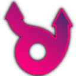

# Game Development Emojis

128x128 sized icons of various game development things.

I have made all of them myself, by going to website/brand/press pages of all these products, downloading official
logo/icon artwork, resizing that to 128x128 size, and adding either a dark or a light outline around it.

***:warning: This is likely against the official branding guidelines of many of these tools!:warning:***

Many of them contain language that says that you can't add an outline or similar; while at the same time making
the logo in such a way that it's not visible on either dark or a light background :facepalm:. Or only allowing
to use their logo if you ensure there's like 100px space around it, and similar -- which is hard to do if
you want to use said logo "in a custom emoji".

So yeah, I don't quite know how "legal" making icons like that is. In any case, all the copyrights,
trade marks, intellectual property etc. etc. of all of those belongs to their original companies and owners.
I made these icons for my own purposes only.

All the 135 icons below, shown at 24pt size:

### engines

</img>
</img>
</img>
</img>
</img>
</img>
</img>
</img>
</img>
</img>
</img>
</img>
</img>
</img>
</img>
</img>
</img>
</img>
</img>
</img>
</img>
</img>
</img>
</img>
</img>
</img>
</img>
</img>
</img>
</img>
</img>
</img>
</img>
</img>

### graphics-apis

</img>
</img>
</img>
</img>
</img>

### misc

</img>
</img>

### networks

</img>
</img>
</img>
</img>

### platforms

</img>
</img>
</img>
</img>
</img>
</img>
</img>
</img>
</img>
</img>
</img>
</img>
</img>
</img>
</img>
</img>
</img>
</img>
</img>
</img>
</img>

### stores

</img>
</img>
</img>
</img>

### tools-audio

</img>
</img>
</img>
</img>
</img>
</img>
</img>
</img>
</img>
</img>
</img>

### tools-ci-vcs

</img>
</img>
</img>
</img>
</img>
</img>
</img>

### tools-graphics

</img>
</img>
</img>
</img>
</img>
</img>
</img>
</img>
</img>
</img>
</img>
</img>
</img>
</img>
</img>
</img>
</img>
</img>
</img>
</img>
</img>
</img>
</img>
</img>
</img>

### tools-ide

</img>
</img>
</img>
</img>
</img>

### tools-other

</img>
</img>
</img>
</img>
</img>
</img>
</img>
</img>
</img>
</img>
</img>
</img>
</img>
</img>
</img>
</img>
</img>
